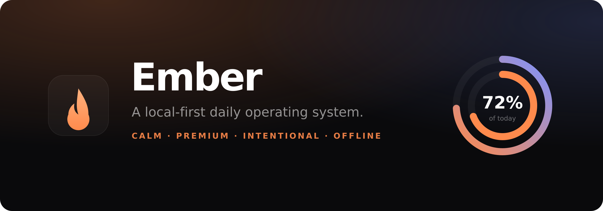
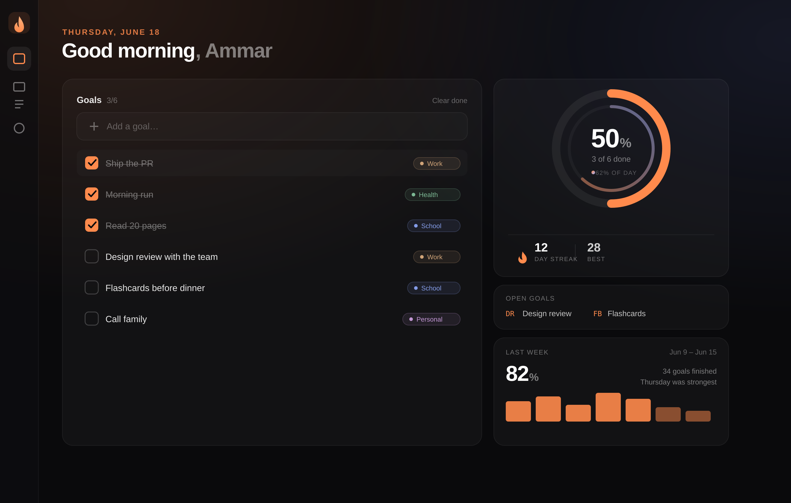
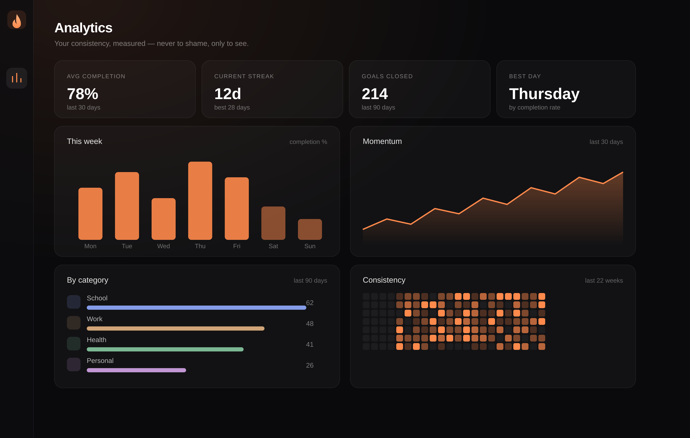
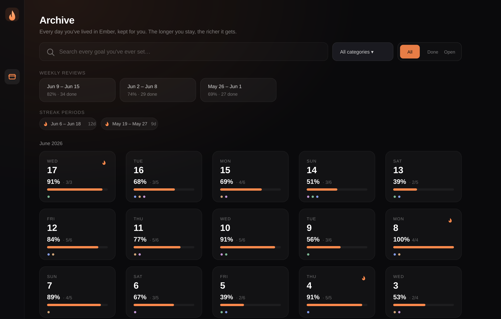

<div align="center">



<br/>

**A local-first daily operating system.**
Calm. Premium. Intentional. Yours alone.

[](https://react.dev)
[](https://www.typescriptlang.org)
[](https://vitejs.dev)
[](#progressive-web-app)
[](LICENSE)

</div>

---

## What is Ember?

Ember is a daily operating system — not just a task list. It exists to carry you across the
gap that defeats most planning tools: the distance between **deciding** what your day should be
and **doing** it.

You set a small number of goals. Ember reflects your day back to you as a living surface — a
progress ring that warms at dawn and cools toward dusk, a streak that quietly rewards
consistency, a focus mode that removes everything except the one thing in front of you. When
the day ends, unfinished work rolls gently into tomorrow, and your history compounds into a
picture of who you're becoming.

Everything runs **on your device**. No account. No backend. No telemetry. Open it offline on a
plane and it's instant.

> Ember is built to feel like a real product — the kind you'd expect from a small, opinionated
> studio. Think Linear's precision, Arc's warmth, Apple's restraint, Raycast's speed.

---

## Screenshots

### Today — the daily dashboard



### Analytics — completion, momentum, categories & consistency



### Archive — every day, searchable forever



---

## Features

**Daily dashboard** — A calm command center: the date, a greeting tuned to the hour, your
completion percentage, and a goal board, all introduced with a soft staggered entrance.

**Day progress ring** — Two concentric arcs in the spirit of Apple Fitness. The outer arc
tracks the day elapsing, its hue traveling from ember-orange at dawn to cool blue at dusk; the
inner arc tracks goals completed.

**Goals, done right** — Create, edit inline, delete, and drag to reorder. A custom-drawn
checkbox animates its tick. Press <kbd>N</kbd> to add from anywhere.

**Focus mode** — One keystroke (<kbd>F</kbd>) collapses the app to a single goal, a breathing
ambient glow, and a 15 / 25 / 50-minute timer. <kbd>Space</kbd> plays and pauses. Everything
else disappears.

**Goal ticker** — A stock-market-inspired marquee of your open goals, with terse ticker
symbols and "time open" deltas. Pauses on hover; respects reduced motion.

**Streak system** — A flame that lights when the day is fully cleared, tracking current and
best streaks. Rewarding, never cheesy — no confetti, no badges, no noise.

**Analytics** — Average completion rate, goals closed, your most productive weekday, weekly
bars, and a 30-day momentum trend. Charts are lazy-loaded so they never slow startup.

**Consistency heatmap** — A GitHub-style contribution graph over the last 22 weeks, shaded by
daily completion.

**Categories** — Optionally tag goals (Health, School, Work, Personal, or your own custom ones,
each with an icon and a muted color). Categories flow everywhere: beside goals, into analytics,
across archive search, and through weekly reviews — always quiet, never loud.

**Smart Archive** — Every completed day is preserved and laid out as a scannable, Apple-Photos /
Arc-history-style timeline grouped by month. Each day card shows completion, goals closed,
category dots, and streak status; open one for the full breakdown of what you finished and what
you didn't. Browse previous streak periods at a glance.

**Instant local search** — Type `math` and every goal you've ever set containing "math" surfaces
across all of history, filterable by category and completion status — entirely in memory, no
backend.

**Weekly reviews** — At the close of each week Ember quietly generates a reflective summary:
completion rate, goals finished, your strongest day, streak movement, a category breakdown, and
daily/category charts. The latest surfaces on the dashboard; the rest live in the archive. In the
spirit of Apple Fitness summaries — reflective, never a scoreboard.

**Tomorrow planning** — A slide-in panel to set tomorrow's intentions tonight. Anything left
unfinished today rolls into tomorrow automatically at the day boundary.

**Command palette** — <kbd>⌘</kbd><kbd>K</kbd> opens a Raycast-style palette: add goals,
enter focus, switch views, change accent, export, import — all keyboard-driven and grouped.

**Full keyboard control** — The entire app is operable without a mouse.

**Local-first & private** — All data lives in your browser. Export the whole thing to JSON and
re-import it anywhere.

**Installable PWA** — Add to your dock or home screen; works fully offline via a service
worker.

**Six accents & a tuned day-start** — Pick a color identity; tell Ember when your day begins so
late-night work counts toward the right day. Reduced-motion and film-grain toggles included.

---

## Keyboard shortcuts

| Key | Action |
| --- | --- |
| <kbd>⌘</kbd>/<kbd>Ctrl</kbd> + <kbd>K</kbd> | Open the command palette |
| <kbd>N</kbd> | New goal |
| <kbd>F</kbd> | Toggle focus mode |
| <kbd>T</kbd> / <kbd>A</kbd> / <kbd>S</kbd> | Today / Analytics / Settings |
| Palette → "Open Archive" / "Search history" | Jump into the archive |
| <kbd>Space</kbd> | Play / pause the focus timer |
| <kbd>Esc</kbd> | Close palette / exit focus |
| <kbd>Enter</kbd> | Confirm in inputs and the palette |
| <kbd>↑</kbd> <kbd>↓</kbd> | Navigate the palette |

---

## Architecture

Ember is a single-page React app with a clean separation between **domain logic** (pure,
testable functions), **state** (two small Zustand stores), and **presentation** (composable,
single-responsibility components). No business logic hides inside components.

```
src/
├─ main.tsx                 # Entry — mounts <App/>, imports global styles
├─ App.tsx                  # Shell: routing-by-view, lifecycle, atmosphere
│
├─ types/                   # Domain models (Goal, Settings, DayRecord, EmberData)
│
├─ lib/                     # Pure, side-effect-free domain logic
│  ├─ date.ts               #   logical-day math, day-start handling, formatting
│  ├─ analytics.ts          #   history rollups, ranges, heatmap matrix, stats
│  ├─ streak.ts             #   current / longest streak computation
│  ├─ accents.ts            #   accent palette + day-driven ring color
│  ├─ io.ts                 #   JSON export / import helpers
│  ├─ id.ts · cn.ts         #   id generation · className composition
│
├─ store/
│  ├─ useStore.ts           # Persisted data: goals, history, settings (+ rollover)
│  └─ useUI.ts              # Ephemeral UI: view, focus, palette, panels, toasts
│
├─ hooks/
│  ├─ useClock.ts           # Re-rendering clock (interval + focus + visibility)
│  ├─ useSelectors.ts       # Derived, memoized reads (today, progress, streak…)
│  ├─ useHotkeys.ts         # Global keyboard layer
│  └─ useAccent.ts          # Active accent as a concrete rgb() string
│
└─ components/
   ├─ ui/                   # Primitives: Surface, Button, ProgressRing, …
   ├─ layout/               # Brand, Dock (rail / bottom-bar)
   ├─ dashboard/            # Greeting, DayRing, StreakBadge, GoalTicker, TodayView
   ├─ goals/                # Checkbox, GoalItem, GoalList, QuickAdd, PlanningPanel
   ├─ focus/                # FocusMode
   ├─ analytics/            # StatCard, Charts, Heatmap, AnalyticsView (lazy)
   ├─ command/              # CommandPalette
   ├─ settings/             # Toggle, SettingsView
   └─ onboarding/           # Onboarding
```

### Data flow

```
 user action ──▶ store action (useStore) ──▶ persisted to localStorage
                       │
                       ▼
        pure selectors (hooks/useSelectors) ── memoized ──▶ components render
                       ▲
   lib/* (date · analytics · streak) — pure functions, no React, unit-friendly
```

### Design decisions worth knowing

- **Logical days, not calendar days.** A configurable *day-start hour* (default 4am) means work
  done at 1am still belongs to the previous day. All date math funnels through `lib/date.ts`.
- **History is sealed, then rolled.** On launch, on window focus, and every minute, `reconcile()`
  snapshots any past day into an immutable `DayRecord` and rolls unfinished goals into today —
  idempotent and safe to call repeatedly.
- **Today is live, the past is frozen.** Analytics merge the persisted history with the *live*
  state of today's goals, so the heatmap and stats update as you check things off.
- **Accent as CSS variables.** Theming is `rgb(var(--accent) / <alpha>)` end-to-end, so a color
  change is a single variable write — no re-styling, no flash.
- **Charts are lazy.** The charting library is code-split behind `React.lazy`; the initial bundle
  stays small and the first paint feels instant.

---

## Tech stack

| Concern | Choice | Why |
| --- | --- | --- |
| Framework | **React 18** + **TypeScript** (strict) | Predictable, typed, ubiquitous |
| Build | **Vite 5** | Instant dev server, lean production output |
| Styling | **Tailwind CSS** + CSS variables | Token-driven, runtime-themeable |
| State | **Zustand** (+ `persist`) | Tiny, no boilerplate, localStorage out of the box |
| Motion | **Framer Motion** | Springs, layout animations, drag-reorder |
| Charts | **Recharts** (lazy) | Composable, declarative, themeable |
| Icons | **lucide-react** | Consistent, minimal line icons |
| Offline | **vite-plugin-pwa** (Workbox) | Installable, precached, offline-first |

---

## Getting started

**Prerequisites:** Node 18+ and npm.

```bash
# install
npm install

# develop (http://localhost:5173)
npm run dev

# typecheck
npm run typecheck

# production build → dist/
npm run build

# preview the production build
npm run preview
```

### Scripts

| Script | Description |
| --- | --- |
| `npm run dev` | Start the Vite dev server |
| `npm run build` | Typecheck, then build to `dist/` |
| `npm run typecheck` | Run the TypeScript project build (no emit) |
| `npm run preview` | Serve the built app locally |

---

## Your data

Ember stores everything under a single `localStorage` key (`ember.store.v1`). Nothing leaves
your device.

- **Export** — Settings → *Export JSON*, or `⌘K → Export data`. You get a timestamped,
  human-readable backup file.
- **Import** — *Import backup* restores a file, merging settings with sane defaults.
- **Reset** — A clearly-guarded action wipes everything and starts fresh.

The export schema is versioned (`version` field) so future migrations stay safe.

```jsonc
{
  "version": 1,
  "goals":   [{ "id": "…", "title": "Ship the README", "date": "2026-06-19", "done": false, "order": 0, "createdAt": 0 }],
  "history": { "2026-06-18": { "date": "2026-06-18", "total": 5, "completed": 5 } },
  "settings": { "accent": "ember", "dayStartHour": 4, "name": "Ammar", "onboarded": true }
}
```

---

## Progressive Web App

Ember ships a service worker and web app manifest via `vite-plugin-pwa`. After building (or in a
deployed environment), your browser will offer to **install** it. Once installed it launches in
its own window, works fully offline, and updates automatically in the background.

---

## Philosophy

1. **Calm over busy.** Software for the day shouldn't add to the noise of the day. Generous
   space, restrained color, motion that informs rather than performs.
2. **Reflection over guilt.** Ember measures consistency to help you *see*, never to shame. An
   unfinished day rolls forward; it isn't a red mark.
3. **Few things, done.** The friction is intentional — a small board you can actually finish
   beats an infinite backlog you can't.
4. **Local-first is a feature, not a limitation.** Your day is yours. No account, no cloud, no
   waiting on a network. Instant, private, durable.
5. **Details are the design.** The drawn checkmark, the ring that warms at dawn, the spring on a
   reorder — polish is not decoration, it's respect.

---

## Roadmap

- [x] Goal categories with per-category analytics *(v1.1)*
- [x] Smart archive with instant local search *(v1.1)*
- [x] Automatic weekly reviews *(v1.1)*
- [ ] Recurring goals & lightweight templates
- [ ] Sub-tasks and notes per goal
- [ ] iCal / Google Calendar read-only overlay
- [ ] Optional end-to-end-encrypted sync across devices
- [ ] Theme studio (custom accent + grain intensity)
- [ ] Cross-device export via QR handoff
- [ ] Unit tests for `lib/*` and a Playwright smoke suite

---

## Contributing

Issues and PRs are welcome. The codebase favors small, single-purpose modules and pure logic in
`lib/`. Before opening a PR, run `npm run typecheck` and `npm run build`.

---

## License

[MIT](LICENSE) © 2026 — Built with intention.
